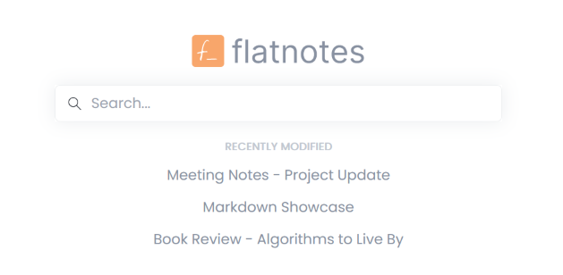

flatnotes is a self-hosted, database-less note-taking web app that utilises a flat folder of markdown files for storage.

Visit the GitHub repo [here](https://github.com/dullage/flatnotes) or see the app in action on the [demo site](https://demo.flatnotes.io/) (_this site resets every 15 minutes_).

### Features

- Mobile responsive web interface
- Raw/WYSIWYG markdown editor modes
- Advanced search functionality
- Note "tagging" functionality
- Light/dark themes
- Multiple authentication options (none, username/password, 2FA)
- Restful API

## Why?

I was, for many years, an avid user of Evernote. Having my notes searchable and available from anywhere is a game changer for organisation and efficiency. But, alas, in 2016 they added a 2-device limit to the free tier. Between my home laptop, work laptop, mobile phone and reluctance to pay, this was a problem.

At the same time Evernote were introducing the new device limit, I also found myself writing more and more notes in plain text (using Notepad++). Without the distraction of formatting, I found it was much quicker to jot down a note.

There are, however, occasions when formatting is useful and so I soon adopted Markdown as my format of choice. I found that it was a good compromise between the simplicity of plain text and the formatting of a rich text editor (like Evernote).

And so, I dropped Evernote in favor of my own patchwork markdown solution. To create and edit my notes I used [Typora](https://typora.io/) on Windows and [1Writer](http://1writerapp.com/) on iOS. Both used a single Dropbox folder to keep things in sync. This worked well for a number of years but was a fairly convoluted setup and so I went in search for a better solution.

To avoid another surprise change in pricing model I wanted something self-hosted and open-source and in that regard, there is  certainly plenty of choice. Just take a look at the [Awesome-Selfhosted list](https://github.com/awesome-selfhosted/awesome-selfhosted#note-taking--editors) and you'll see plenty of great apps. At the time, I went through every option in that list and although some came close, none quite made the mark. In particular, a lot of the choices that supported markdown utilised a split view where the raw markdown is on the left and the rendered view is on the right. I wanted something more akin to the [Bear app](https://bear.app/) where you can write in raw markdown that is then rendered inline.

So I decided to write my own.

## Frontend Design

I designed flatnotes to be clean, simple and distraction-free. As soon as the app loads, the search box is focussed allowing you to jump straight to the note you want. There's also a quick jump menu underneath making it easy to return to a note you were previously working on.



The only additional UI element is a very minimal navbar in the top right.



flatnotes intentionally omits any kind of hierarchical structure (e.g. folders). I used to spend way too much time carefully organising my notes into separate folders (or notebooks as they're known in Evernote) but I never actually benefitted from that additional admin as I would just naturally be drawn to using the search functionality.

Although there aren't any folders, flatnotes does support the concept of tagging. You can "tag" a note by using a hashtag anywhere in the content. For example, a note with the following content would be tagged with personal and holiday:

```markdown
# Holiday Ideas

- Amsterdam
- Geneva
- Zurich
- Rome

#personal #holiday
```

These tags are then searchable both directly (i.e. show me all the notes tagged with `#holiday`) and indirectly (i.e. show me all the notes that contain the word 'holiday' either as a tag or in the rest of the content).


## Backend Design

The simplicity of the design also extends to the backend as well. I wanted to continue to be able to edit my notes outside of flatnotes and so I opted to avoid using a database. All of the notes are simply stored as markdown files in a single, flat (hence the name) folder. There is a search index to maintain but this is incrementally synchronised whenever a search is run. Of course, there is a performance penalty to pay for this but in reality, the impact is negligible and - to my mind - is outweighed by the simplicity.

The other benefit to this is that, should you wish to switch to another note-taking app, your data is easily portable (it's just a folder of markdown files).

## Tech Stack

Mainly due to familiarity, I chose Python for the backend and Vue JS for the frontend.

I used [FastAPI](https://fastapi.tiangolo.com/) to take care of the API side of things. I love this framework for its ease of use and features such as automatically exposing [swagger documentation](https://demo.flatnotes.io/docs).

Full-text searching is handled by an excellent Python package called [Whoosh](https://whoosh.readthedocs.io/en/latest/intro.html).

Of course, the biggest part of the user experience is the text editor and for this I chose the [Toast UI Editor](https://github.com/nhn/tui.editor). This is a fantastic editor that supports both WYSIWYG and raw markdown (with inline styling).

## Getting Started

For details on how you can use flatnotes yourself, see the README in the [GitHub repo](https://github.com/dullage/flatnotes) which includes both self-hosted and hosted options.
